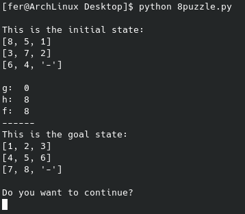

# 8-puzzle-problem-A*-search
It is a python terminal script that solves the [8 puzzle problem](https://www.cs.princeton.edu/courses/archive/spr10/cos226/assignments/8puzzle.html) using the [A* Search algorithm](https://en.wikipedia.org/wiki/A*_search_algorithm).

## Comand
* python 8puzzle.py
